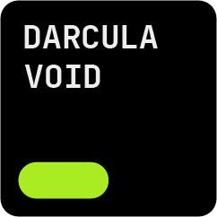
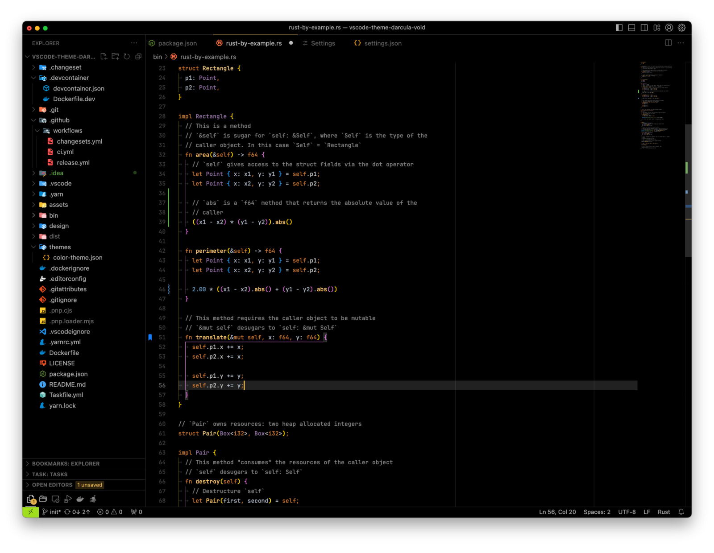

<h3 id="darcula-void" align="center">
  <br>
    
  <br>
  Darcula Void
  <br>
</h1>

##

<div align="center">
  <p>Theme for Visual Studio Code, based on&nbsp;the Darcula theme <br> from JetBrains IDEs, with a&nbsp;pure black background.</p>
</div>

<p align="center">
  <a href="https://vscode.dev/theme/sjlex.vscode-theme-darcula-void"></a>&nbsp;
  <a href="https://marketplace.visualstudio.com/items?itemName=sjlex.vscode-theme-darcula-void"></a>&nbsp;
  <a href="https://marketplace.visualstudio.com/items?itemName=sjlex.vscode-theme-darcula-void"></a>&nbsp;
  <a href="https://marketplace.visualstudio.com/items?itemName=sjlex.vscode-theme-darcula-void"></a>&nbsp;
  <a href="https://marketplace.visualstudio.com/items?itemName=sjlex.vscode-theme-darcula-void&ssr=false#version-history"></a>&nbsp;
  <a href="https://github.com/sjlex/vscode-theme-darcula-void/blob/main/LICENSE"></a>&nbsp;
</p>



## Table of contents

- [Darcula Void](#darcula-void)
  - [Table of contents](#table-of-contents)
  - [Getting started](#getting-started)
    - [Installation](#installation)
    - [Activate theme](#activate-theme)
  - [Recommended settings](#recommended-settings)
    - [Font settings](#font-settings)
    - [Icon Themes](#icon-themes)
  - [Inspiration](#inspiration)
  - [License](#license)

## Getting started

<h3 id="installation">📦 Installation</h3>

You can install this theme through the [Visual Studio Code Marketplace](https://marketplace.visualstudio.com/items?itemName=sjlex.vscode-theme-darcula-void).

Launch **Quick Open**:

- Windows: `Ctrl + P`
- macOS: `⌘ + P`
- Linux: `Ctrl + P`

Paste the following command and press `Enter`:

```shell
ext install sjlex.vscode-theme-darcula-void
```

<h3 id="activate-theme">☑️ Activate theme</h3>

Open **Command Palette**:

- Windows: `Ctrl + Shift + P`
- macOS: `⌘ + Shift + P`
- Linux: `Ctrl + Shift + P`

Type `theme`, choose `Preferences: Color Theme`, and select `Darcula Void` from the list.

<h2 id="recommended-settings">⚙️ Recommended settings</h3>

### Font settings

`settings.json`:

```json
{
  "editor.fontFamily": "JetBrains Mono",
  "editor.fontSize": 12,
  "editor.lineHeight": 18,
  "terminal.integrated.fontSize": 11
}
```

### Icon Themes

You can install one of&nbsp;the Icon Themes below:

- [Material Icon Theme](https://marketplace.visualstudio.com/items?itemName=PKief.material-icon-theme)

- [JetBrains Icon Theme](https://marketplace.visualstudio.com/items?itemName=chadalen.vscode-jetbrains-icon-theme)

## Inspiration

- [JetBrains Darcula Theme](https://marketplace.visualstudio.com/items?itemName=Anan.jetbrains-darcula-theme)

## License

[MIT License](LICENSE)
